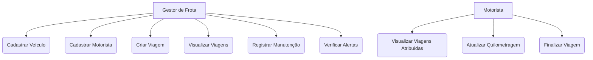
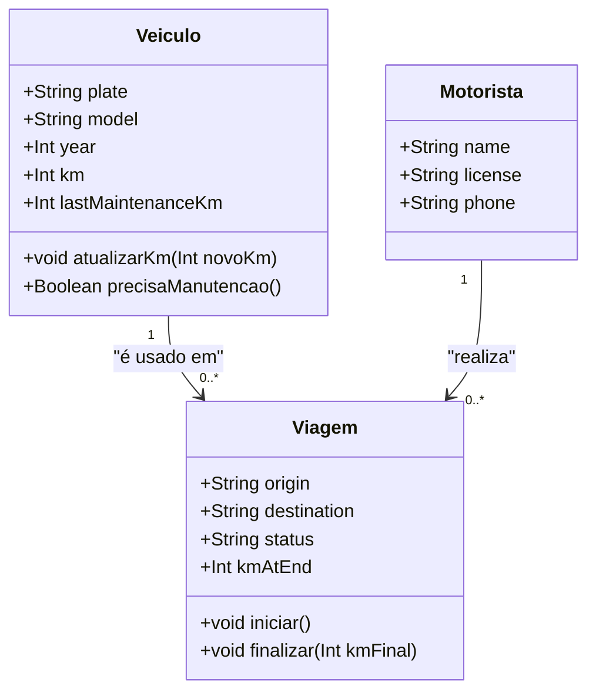

# 🚛 LogiMax Fleet Manager

---
Sistema de Gerenciamento de Frotas desenvolvido em **Next.js + TypeScript + Mongoose**, com o objetivo de facilitar o controle de veículos, motoristas e viagens da empresa **LogiMax Transportes**.

---

## 📚 Sumário

- [📖 Descrição Geral](#-descrição-geral)
- [👥 Público-Alvo](#-público-alvo)
- [⚙️ Tecnologias Utilizadas](#️-tecnologias-utilizadas)
- [🧱 Arquitetura do Projeto](#-arquitetura-do-projeto)
- [🧩 Entidades Principais](#-entidades-principais)
- [🧠 Funcionalidades do Sistema](#-funcionalidades-do-sistema)
- [🎦 Design do Dashboard](#-design-do-dashboard)
- [⚠️ Alertas de Manutenção](#️-alertas-de-manutenção)
- [📊 Variáveis de Ambiente Suportadas](#-variáveis-de-ambiente-suportadas)
- [🔗Diagramas](#diagramas)
- [📝 Prototipagem](#-prototipagem)
- [👩‍💻 Autora](#-autora)

---

## 📖 Descrição Geral

O **LogiMax Fleet Manager** é uma aplicação web voltada para o **gestor de frotas** e **motoristas** da empresa.  
O sistema permite:

- Cadastrar veículos e motoristas  
- Criar e gerenciar viagens  
- Atualizar a quilometragem do veículo ao finalizar a viagem  
- Registrar manutenções a cada 10.000 km  
- Visualizar o status das viagens e alertas de manutenção  

O projeto foi construído com foco na **simplicidade, clareza e funcionalidade**, servindo como um protótipo completo de gerenciamento de frotas.

---

## 👥 Público-Alvo

- **Gestor de Frotas:**  
  Responsável por cadastrar veículos, motoristas e programar viagens.  
  Pode visualizar todas as informações e registrar manutenções.

- **Motorista:**  
  Visualiza apenas as viagens atribuídas a ele e informa a quilometragem final ao concluir o percurso.

---

## ⚙️ Tecnologias Utilizadas

| Tecnologia | Descrição |
|-------------|------------|
| **Next.js 14** | Framework React para renderização híbrida (frontend + backend) |
| **TypeScript** | Tipagem estática para maior segurança e clareza no código |
| **Mongoose** | ODM para conexão e manipulação de dados no MongoDB |
| **MongoDB** | Banco de dados NoSQL usado para armazenar veículos, motoristas e viagens |
| **Node.js** | Ambiente de execução JavaScript |
| **npm** | Gerenciador de pacotes e scripts do projeto |

---

## 🧱 Arquitetura do Projeto

```
logimax/
├── src/
│   ├── app/
│   │   ├── api/               → Rotas de API (CRUD de veículos, motoristas, viagens)
│   │   ├── dashboard/         → Página principal do sistema (painel visual)
│   │   └── page.tsx           → Tela de login
│   ├── controllers/           → Lógica de negócios de cada entidade
│   ├── models/                → Modelos Mongoose (Vehicle, Driver, Trip)
│   └── services/
│       └── mongoose.ts        → Conexão com o banco de dados
├── .env.local                 → Variáveis de ambiente
├── package.json               → Dependências e scripts
├── tsconfig.json              → Configuração TypeScript
└── README.md                  → Documentação do projeto
```

---

## 🧩 Entidades Principais

### 🚗 Veículo
| Campo | Tipo | Descrição |
|-------|------|------------|
| `plate` | String | Placa do veículo |
| `model` | String | Modelo do veículo |
| `year` | Number | Ano de fabricação |
| `km` | Number | Quilometragem atual |
| `lastMaintenanceKm` | Number | Km da última manutenção (para alertas) |

### 🧍 Motorista
| Campo | Tipo | Descrição |
|-------|------|------------|
| `name` | String | Nome completo |
| `license` | String | Número da CNH |
| `phone` | String | Contato (opcional) |

### 🛣️ Viagem
| Campo | Tipo | Descrição |
|-------|------|------------|
| `vehicleId` | ObjectId | Veículo associado |
| `driverId` | ObjectId | Motorista responsável |
| `origin` | String | Local de partida |
| `destination` | String | Local de chegada |
| `status` | String | Agendada, Em Curso ou Finalizada |
| `kmAtEnd` | Number | Quilometragem final (ao encerrar) |

---

## 🧠 Funcionalidades do Sistema

| Módulo | Descrição |
|---------|------------|
| **Login** | Entrada simples com nome do usuário (Gestor ou Motorista) |
| **Dashboard** | Exibe os módulos de Veículos, Motoristas e Viagens em cartões estilizados |
| **Veículos** | CRUD completo, com alerta automático de manutenção |
| **Motoristas** | Cadastro simples com nome e CNH |
| **Viagens** | Criação e finalização de viagens; atualização automática do km do veículo |
| **Manutenção** | Atualiza `lastMaintenanceKm` e remove o alerta após o registro |

---

## 🎦 Design do Dashboard

- Layout em **grid responsivo**
- Cores neutras e tipografia legível
- Cartões com **bordas arredondadas e sombra leve**
- **Botões coloridos** e inputs padronizados
- Ícones para seções (🚗 🧍 🛣️)

---

## ⚠️ Alertas de Manutenção

O sistema calcula automaticamente se um veículo precisa de manutenção:
```ts
(vehicle.km - vehicle.lastMaintenanceKm) >= 10000
```
Se a condição for verdadeira, o veículo recebe o aviso **⚠️ “Precisa de manutenção”**.

---

## 📊 Variáveis de Ambiente Suportadas

| Variável | Descrição |
|-----------|------------|
| `MONGODB_URI` | Conexão com MongoDB (Atlas ou local) |
| `DATABASE_URL` | Alternativa aceita para MONGODB_URI |
| `JWT_NATHY` | (Reservada) Token para futuras autenticações |

---

### 🔗Diagramas

**Diagrama de Fluxo**
 ```mermaid

 flowchart TD
    A[Gestor de Frota] -->|Cadastra| B[Veículo]
    A -->|Cadastra| C[Motorista]
    A -->|Cria| D[Viagem]
    D -->|Define| E[Origem e Destino]
    D -->|Atribui| C
    D -->|Atribui| B
    C -->|Visualiza| D
    C -->|Atualiza Km Final| B
    B -->|Verifica| F[Alerta de Manutenção ⚠️]
    F -->|>= 10.000 km| G[Registrar Manutenção]

```
**Diagrama de Casos de Uso**



**Diagrama de Classe**

---
## 📝 Prototipagem

- Link Figma: 
  - [Link](https://www.figma.com/design/J5liaOG3JFRDAc9P3WUh1c/Sem-t%C3%ADtulo?node-id=0-1&t=mtF5uc5PkeNIssD7-1)

---

## 👩‍💻 Autora

**Projeto desenvolvido por:**

👩‍💻 *Nathaly Maria Gallante Smanioto* 

---


